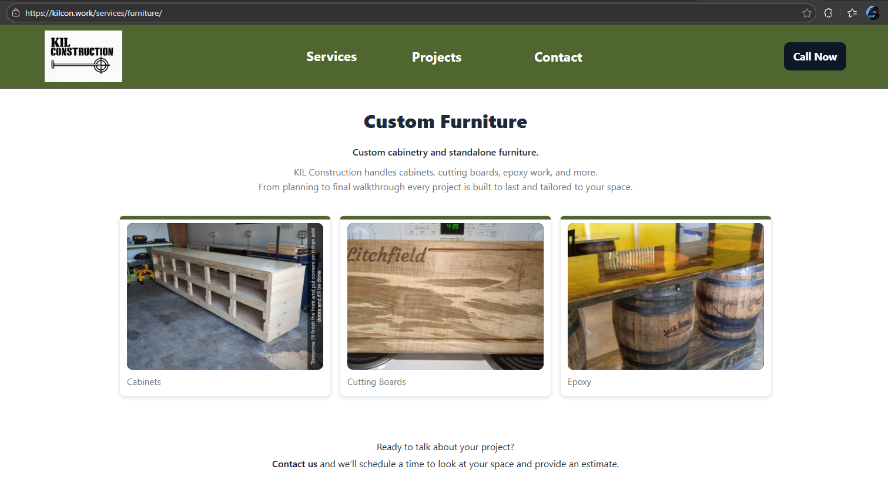
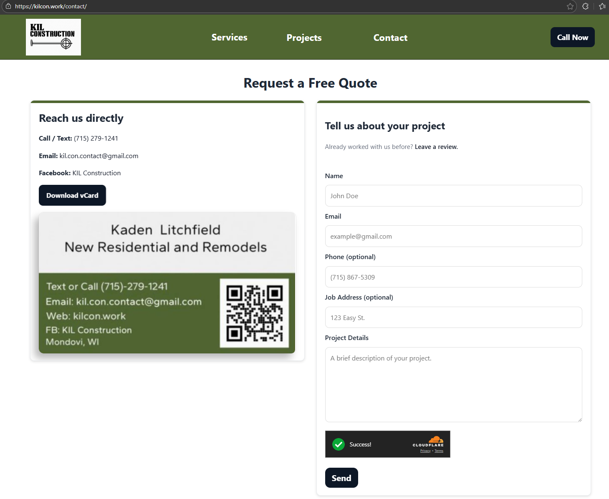
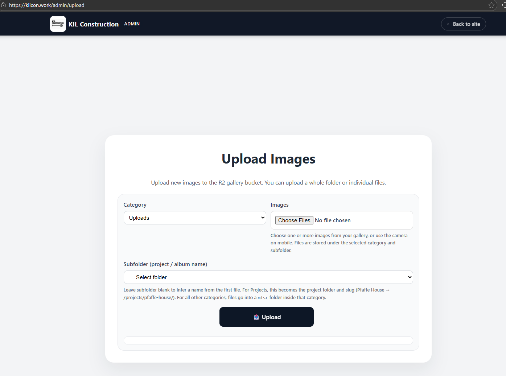

# KIL Construction Platform
Serverless content platform with secure media management built on **Cloudflare Workers**, **R2**, and **Astro**.

  
  
  
  
  

---

  
<strong>Table of Contents</strong>

- [Overview](#overview)
- [Tech Stack](#tech-stack)
- [Features](#features)
- [Architecture](#architecture)
- [Screenshots](#screenshots)
- [Development Setup](#development-setup)
- [Status](#status)
- [License](#license)

---

## Overview

KIL Construction's platform delivers a fast, CDN-optimized website paired with secure administrative tools for managing project galleries, rotating images, and structured media categories.

The frontend (Astro) communicates with **two Cloudflare Workers**:

1. **Gallery + Reviews Worker** (external repo)  
   – Handles gallery listing, reviews, admin authentication, and all R2 operations.

2. **Contact Worker (`kilcon-contact`)**  
   – Handles **POST `/api/contact`**, email forwarding, and Turnstile validation.  
   – Lives entirely in Cloudflare, not in this repository.

This repo contains **only the Astro frontend** and no backend secrets or Worker code.

---

## Tech Stack

### Frontend

  
  
  
  

### Backend

  
  

### Storage
📦 Cloudflare R2 Object Storage

---

## Features

- Serverless backend powered by **Cloudflare Workers**
- **Gallery + Reviews Worker** (external repo) for admin operations, R2, and public listing
- **Contact Worker** (`/api/contact`) for email forwarding + Turnstile verification
- Dynamic **Astro** frontend with category/project routing
- Secure cookie-based admin authentication
- Upload, rename, delete, and organize media in R2
- Featured review sorting + homepage review rotation
- Rotating project cards for modern visual previews
- Zero-downtime deployments + global CDN caching

---

## Architecture

<strong>Click to expand architecture details</strong>

### Frontend (Astro)

- Static + dynamic hybrid rendering  
- Responsive gallery layouts  
- Rotating image card components  
- Integrates directly with Worker API endpoints  

### Backend (Cloudflare Workers)

- **Gallery + Reviews Worker (`kilcon-gallery-worker`)**  (external repository) 
  - Handles all media/gallery operations  
  - Review submission + featured review ordering  
  - Admin authentication (cookie-based)  
  - R2 object reading/writing  
  - Frontend calls it via:  
    - `/api/gallery-api*`  
    - `/api/reviews*`

- **Contact Worker (`kilcon-contact`)**  
  - Handles **POST `/api/contact`**  
  - Sends emails using Resend  
  - Validates Turnstile tokens  
  - Required environment variables:  
    - `RESEND_API_KEY`  
    - `FROM_EMAIL`  
    - `TO_EMAIL`  
    - `TURNSTILE_SECRET`  
  - Deployed in Cloudflare, not stored in this repo

### Storage (R2 Object Storage)
- Category folders: `Projects/`, `Furniture/`, `Remodels/`, etc.  
- Deterministic numeric prefix ordering  
- Scalable object storage  

### Security
- Secret-based admin authentication  
- Cookie session validation  
- Domain-level request verification  

---

## Screenshots
📸 Visual overview of the platform:

<table>
  <tr>
    <td align="center">
      <strong>Homepage</strong> 
      
    </td>
    <td align="center">
      <strong>Project Gallery View</strong> 
      
    </td>
  </tr>
  <tr>
    <td align="center">
      <strong>Service Gallery View</strong> 
      
    </td>
    <td align="center">
      <strong>Contact Page</strong> 
      
    </td>
  </tr>
  <tr>
    <td align="center">
      <strong>Admin – Project List</strong> 
      
    </td>
    <td align="center">
      <strong>Admin – Upload & Actions</strong> 
      
    </td>
  </tr>
  <tr>
    <td align="center">
      <strong>Admin – Image Detail</strong> 
      
    </td>
    <td align="center">
      <strong>Admin – Confirmation/Status</strong> 
      
    </td>
  </tr>
</table>

---

## Development Setup
Prerequisites
- Node 18+
- Cloudflare account with R2 bucket configured
- Wrangler CLI (optional – only needed if you want to run Workers locally)

Install & Run
npm install
npm run dev

Deploy
npm run deploy

Environment Variables

This repository contains **only frontend-safe** environment variables:

- PUBLIC_GALLERY_API=
- PUBLIC_CONTACT_ENDPOINT=

All sensitive values (ADMIN_SECRET, R2 paths, email API keys, Turnstile secret, etc.)  
are configured directly inside Cloudflare Worker settings and are **not stored in this repo**.
  
---

## Status
This platform is actively deployed for a private construction company.
Source code is provided solely for portfolio/demo purposes.

## License

> **Proprietary Software — KIL Construction**  
> Unauthorized use, reproduction, or distribution of this code is prohibited. 

---

<strong>Legal Notice:</strong> All code and assets within this repository are the confidential and proprietary
property of KIL Construction. No part of this project may be copied, modified, published, or distributed
without prior written consent. Access is provided solely for portfolio review and technical evaluation.

